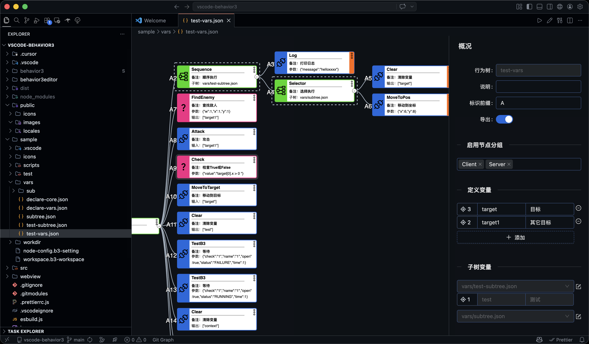

# Behavior3 Editor

VS Code behavior tree visual editor for game AI workflows.

## Related Projects

- **[behavior3-ts](https://github.com/codetypess/behavior3-ts)** - TypeScript Runtime Library
- **[behavior3lua](https://github.com/zhandouxiaojiji/behavior3lua)** - Lua Runtime

## Editor Preview



The editor provides an intuitive visual interface for designing and managing behavior trees. See the screenshot above for the full editing experience with node canvas, inspector panel, and tree organization.

## Features

- Visual canvas editor (drag, connect, organize nodes)
- Built-in inspector panel for node/tree properties
- Custom node definitions via `.b3-setting`
- One-click build command in editor title bar
- Optional expression validation for node args
- Auto theme adaptation (dark/light)

## Quick Start

### Open a tree file

- Right-click a tree `.json` file in Explorer
- Select **Open With** → **Behavior3 Editor**

### Create a new project

- Right-click a folder in Explorer
- Run **Behavior Tree: Create Project**

### Configure nodes

Create a `.b3-setting` file in workspace:

```json
[
    {
        "name": "MyAction",
        "type": "Action",
        "desc": "Does something useful",
        "args": [{ "name": "duration", "type": "float", "desc": "Duration in seconds" }]
    },
    {
        "name": "CheckScore",
        "type": "Condition",
        "desc": "Checks whether the score matches the rule",
        "args": [{ "name": "value", "type": "expr", "desc": "Expression" }]
    }
]
```

### Build

Click **Build** in the editor title bar.

### Command Line Build

The npm package exposes a `behavior3-build` command for CI and project scripts:

```bash
npm install -D vscode-behavior3
```

```json
{
    "scripts": {
        "build:behavior": "behavior3-build --project ./workdir/hero.json --output ./dist/behavior3"
    }
}
```

You can also run it without adding a script:

```bash
npm exec -- behavior3-build --project ./workdir/hero.json --output ./dist/behavior3
```

Or run it without installing first:

```bash
npx --package vscode-behavior3 behavior3-build --project ./workdir/hero.json --output ./dist/behavior3
```

Publishing flow:

```bash
npm login
npm whoami
npm version patch
npm run pack:npm
npm run publish:npm
```

`npm run pack:npm` performs the same prepack checks as publishing and prints the
tarball contents without publishing.

### Build Script (`.b3-workspace`)

`settings.buildScript` supports ESM scripts:

- JavaScript: `.js`, `.mjs`
- TypeScript: `.ts`, `.mts` (runtime transpile, no type-check)

TypeScript build scripts can import other local TypeScript files with explicit
extensions:

```ts
import { helper } from "./helper.ts";
```

To debug TypeScript build scripts, launch the CLI with Node inspector and enable
build-script debug mode:

```bash
BEHAVIOR3_BUILD_DEBUG=1 node --inspect-brk dist/build-cli.js --output /tmp/b3build --project sample/workdir/hero.json
```

This emits inline source maps and creates temporary `.runtime.*.mjs` files next
to the build script while the build runs so breakpoints in `build.ts` and
imported helper files can bind. The runtime files are removed after the build
completes; if the build script fails to load, they are left in place for
inspection. Editor debug builds also clean runtime files when the debug session
terminates.
Inside the editor, `Ctrl+B`/`Cmd+B` builds normally, while
`Ctrl+Shift+B`/`Cmd+Shift+B` starts a VS Code Node debug session for the build.

Example:

```json
{
    "settings": {
        "checkExpr": true,
        "buildScript": "scripts/build.ts",
        "checkScripts": ["scripts/checkers/**/*.ts"]
    }
}
```

`settings.checkScripts` is optional and loads additional checker-only scripts
relative to the `.b3-workspace` directory. Matching scripts are scanned for
exported `@behavior3.check("name")` classes and are used by both the editor
Inspector validation and project builds. Generated `.runtime.*.mjs`, `.d.ts`,
`node_modules`, `dist`, and `build` paths are ignored.

All build hooks receive `env`:

- `env.fs`: Node `fs`
- `env.path`: full path helper object (all methods exposed)
- `env.workdir`: resolved workspace directory
- `env.nodeDefs`: loaded node definitions map
- `env.logger`: `log/debug/info/warn/error`

Use an exported `@behavior3.build` class. The decorator is provided by the build
runtime, so no value import is required. The extension constructs the class once
with `env`, then calls methods:

- `constructor(env)`
- `onProcessTree(tree, path, errors)`
- `onProcessNode(node, errors)`
- `onWriteFile(path, tree)`
- `onComplete(status)`

```ts
import type { BuildEnv, TreeData } from "vscode-behavior3/build";

@behavior3.build
export class ProjectBuild {
    constructor(private readonly env: BuildEnv) {}

    onProcessTree(tree: TreeData) {
        this.env.logger.info("building", tree.name);
        return tree;
    }
}
```

For compatibility, supported script files may still export a class via named
`Hook` or `default`.

For TypeScript authoring hints, import build script types from
`vscode-behavior3/build`. See `sample/scripts/build.ts` for a complete example.

## Extension Settings

| Setting               | Type    | Default  | Description                                                      |
| --------------------- | ------- | -------- | ---------------------------------------------------------------- |
| `behavior3.checkExpr` | boolean | `true`   | Enable expression syntax validation for expression-type args.    |
| `behavior3.language`  | string  | `"auto"` | Editor UI language. Options:`auto` (follow VS Code), `zh`, `en`. |

## Inspector

Inspector is embedded on the right side of the tree editor.

- Select a node to edit node fields (`args`, `input`, `output`, `desc`, `debug`, `disabled`)
- Click empty canvas to edit tree fields (`name`, `desc`, `vars`, `import`, `group`)

## Keyboard Shortcuts

| Key                      | Action                         |
| ------------------------ | ------------------------------ |
| `Ctrl/Cmd+Z`             | Undo                           |
| `Ctrl+Y` / `Cmd+Shift+Z` | Redo                           |
| `Ctrl/Cmd+C`             | Copy node                      |
| `Ctrl/Cmd+V`             | Paste node                     |
| `Ctrl/Cmd+Shift+V`       | Replace node                   |
| `Enter` / `Insert`       | Insert node                    |
| `Delete` / `Backspace`   | Delete selected node           |
| `Ctrl/Cmd+F`             | Search node content            |
| `Ctrl/Cmd+G`             | Jump to node by id             |
| `Ctrl/Cmd+B`             | Build                          |
| `F4`                     | Toggle Text / Behavior3 editor |

## Development

- Output logs: **View → Output** → channel **Behavior3**
- Webview logs are also available in DevTools

## Requirements

- VS Code 1.85.0+

## License

MIT
